# 📊 Study Planner - Sơ đồ Hệ thống

Tài liệu này cung cấp các sơ đồ chính của hệ thống Study Planner dưới dạng code PlantUML.

> **Hướng dẫn sử dụng**: Copy code PlantUML vào các công cụ như [PlantUML Online](https://www.plantuml.com/plantuml/uml), [PlantText](https://www.planttext.com/), hoặc extension PlantUML trong VS Code để render sơ đồ.

---

## 📑 Mục lục
1. [Sơ đồ Use Case](#1-sơ-đồ-use-case)
2. [Sơ đồ Class (ERD)](#2-sơ-đồ-class-erd)
3. [Sơ đồ Sequence - Đăng nhập](#3-sơ-đồ-sequence---đăng-nhập)
4. [Sơ đồ Sequence - CRUD Task](#4-sơ-đồ-sequence---crud-task)
5. [Sơ đồ Activity - Quản lý Task](#5-sơ-đồ-activity---quản-lý-task)
6. [Sơ đồ Luồng Dữ liệu (DFD Level 0)](#6-sơ-đồ-luồng-dữ-liệu-dfd-level-0)
7. [Sơ đồ Luồng Dữ liệu (DFD Level 1)](#7-sơ-đồ-luồng-dữ-liệu-dfd-level-1)
8. [Sơ đồ Component](#8-sơ-đồ-component)
9. [Sơ đồ Deployment](#9-sơ-đồ-deployment)

---

## 1. Sơ đồ Use Case

### 1.1 Use Case Tổng quan

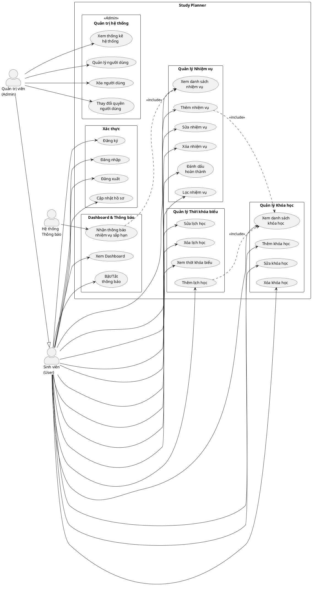

### 1.2 Use Case Chi tiết - Quản lý Nhiệm vụ

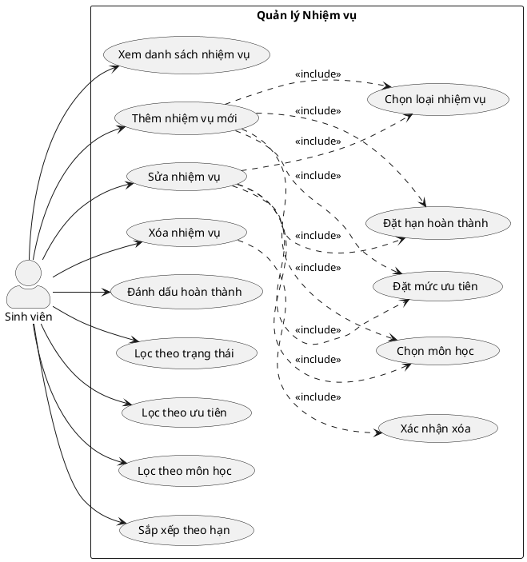

---

## 2. Sơ đồ Class (ERD)

### 2.1 Entity Relationship Diagram

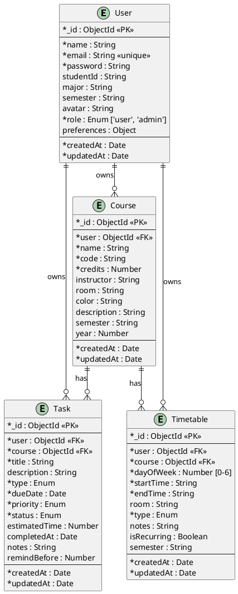

### 2.2 Class Diagram Chi tiết

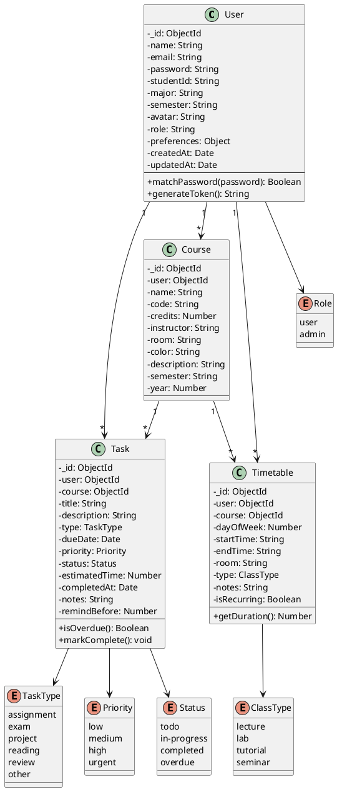

---

## 3. Sơ đồ Sequence - Đăng nhập

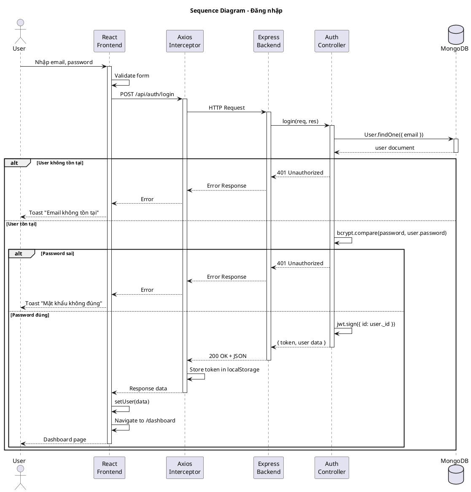

---

## 4. Sơ đồ Sequence - CRUD Task

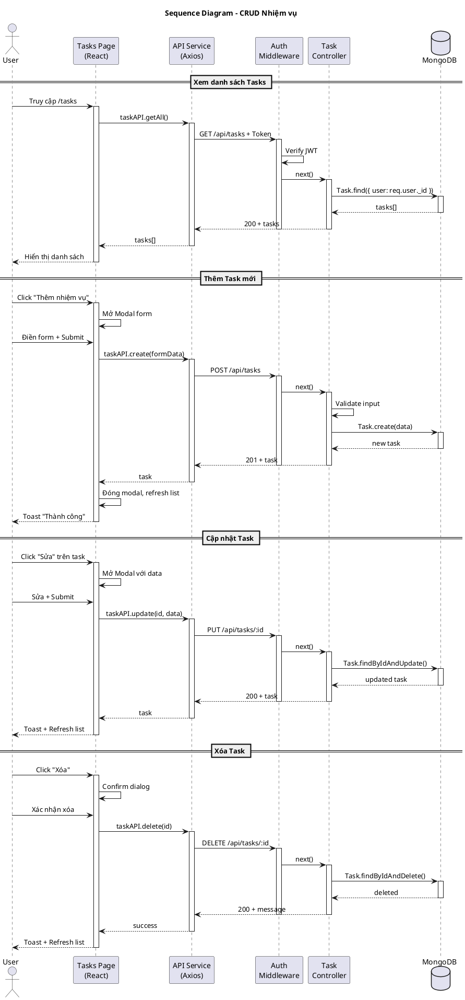

---

## 5. Sơ đồ Activity - Quản lý Task

### 5.1 Activity - Tạo Task mới

```plantuml
@startuml Activity - Create Task

start

:User click "Thêm nhiệm vụ";

:Mở form modal;

:Chọn môn học từ dropdown;

:Nhập tiêu đề nhiệm vụ;

:Chọn loại nhiệm vụ;
note right
  - Bài tập
  - Kiểm tra
  - Dự án
  - Đọc tài liệu
  - Ôn tập
  - Khác
end note

:Chọn mức ưu tiên;
note right
  - Thấp
  - Trung bình
  - Cao
  - Khẩn cấp
end note

:Chọn hạn hoàn thành;

:Nhập mô tả (tùy chọn);

:Click "Lưu";

if (Form hợp lệ?) then (không)
  :Hiển thị lỗi validation;
  :Quay lại chỉnh sửa;
  backward :Sửa form;
else (có)
  :Gửi request POST /api/tasks;
  
  if (API thành công?) then (có)
    :Đóng modal;
    :Refresh danh sách;
    :Hiển thị toast "Thành công";
  else (không)
    :Hiển thị toast lỗi;
  endif
endif

stop

@enduml
```

### 5.2 Activity - Đánh dấu hoàn thành Task

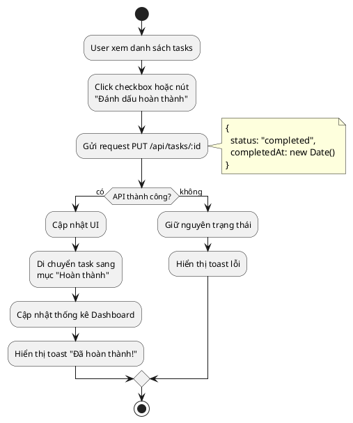

### 5.3 Activity - Luồng Thông báo Task

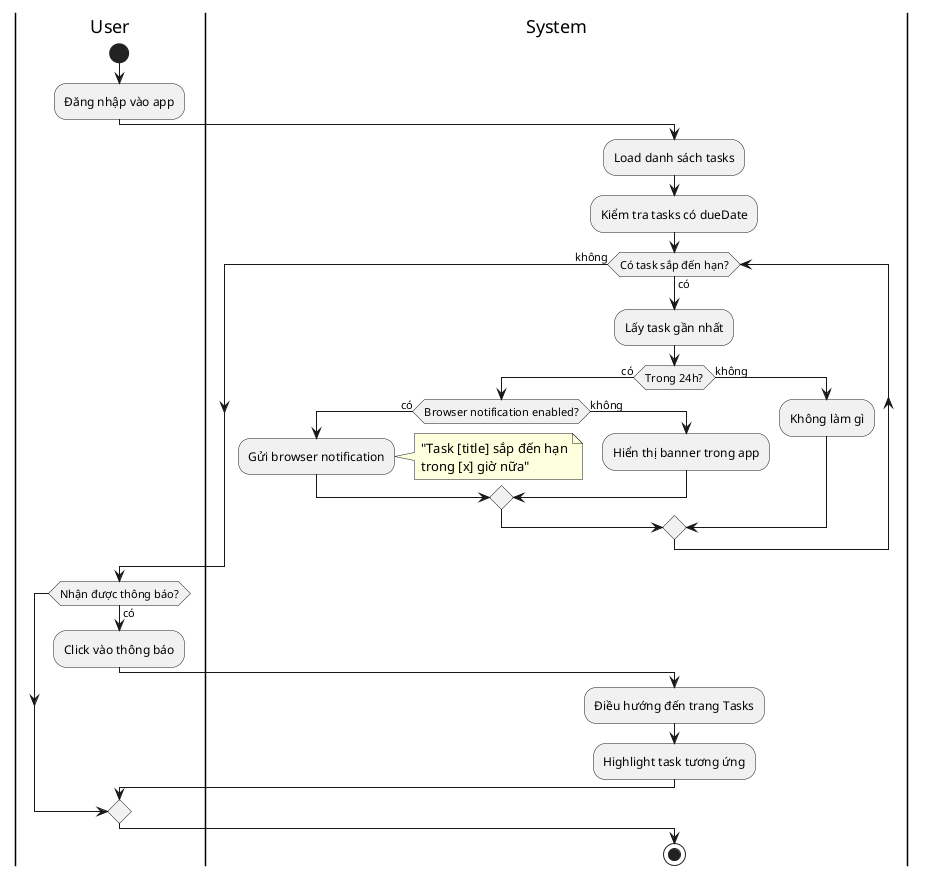

---

## 6. Sơ đồ Luồng Dữ liệu (DFD Level 0)

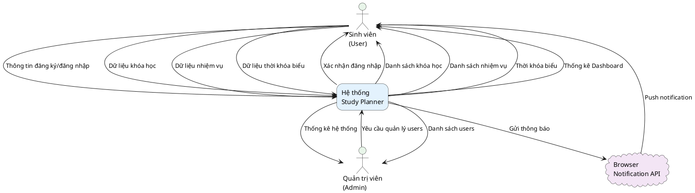

---

## 7. Sơ đồ Luồng Dữ liệu (DFD Level 1)

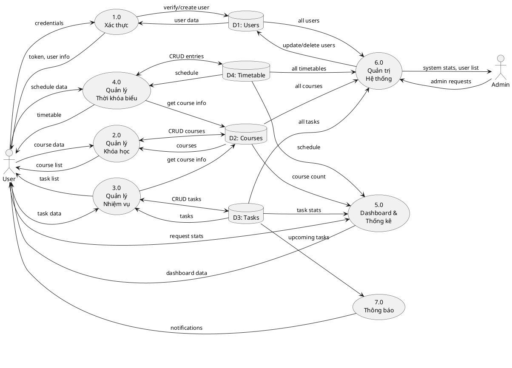

---

## 8. Sơ đồ Component

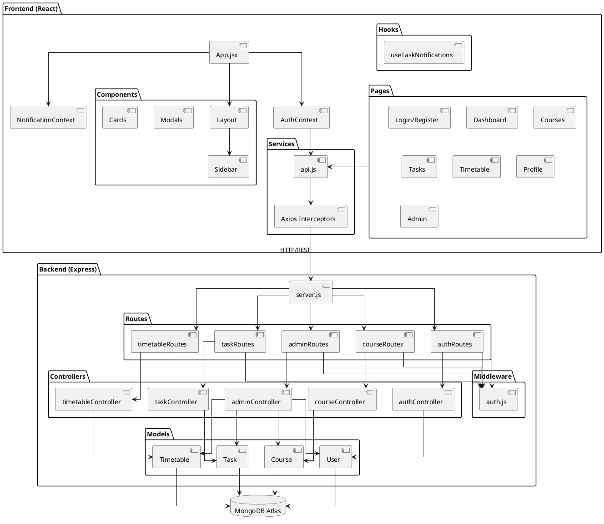

---

## 9. Sơ đồ Deployment

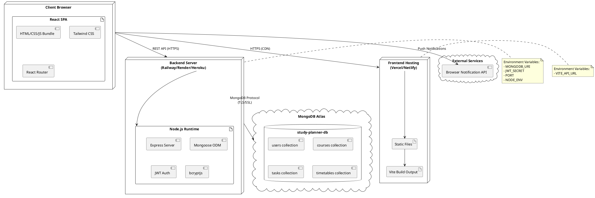

---

## 10. Sơ đồ State - Task Status

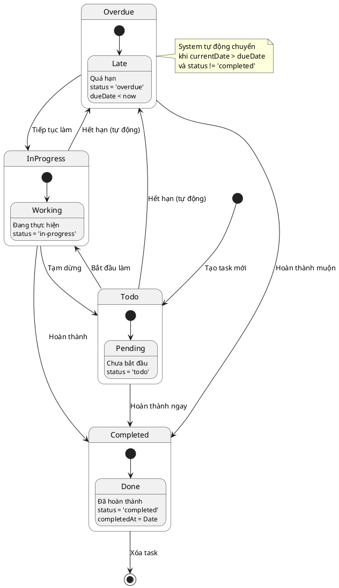

---

## 11. Sơ đồ Sequence - Admin Delete User (Cascade)

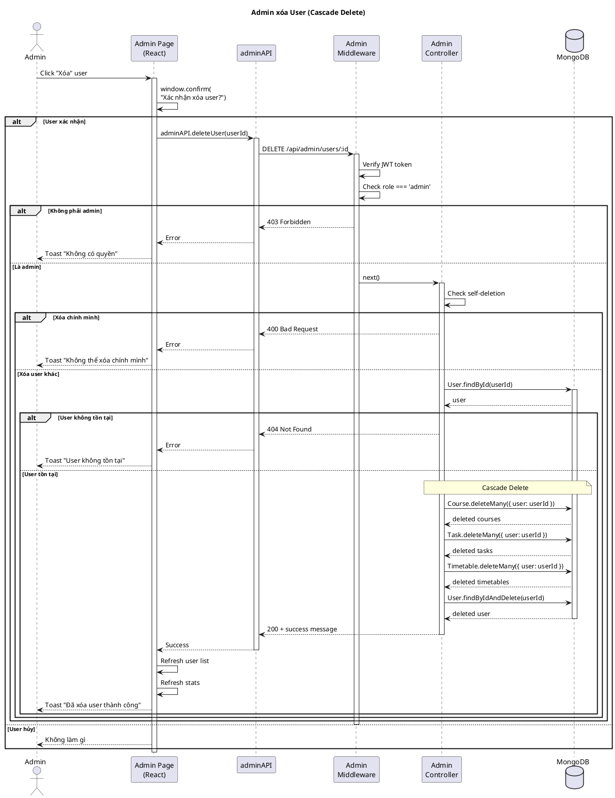

---

## 📌 Ghi chú

### Công cụ render PlantUML:
1. **Online**: 
   - https://www.plantuml.com/plantuml/uml
   - https://www.planttext.com/
   - https://kroki.io/

2. **VS Code Extension**: 
   - PlantUML (jebbs.plantuml)
   - Cần cài Java và Graphviz

3. **IDE Integration**:
   - IntelliJ IDEA PlantUML plugin
   - Eclipse PlantUML plugin

### Cách sử dụng:
1. Copy đoạn code PlantUML (bao gồm `@startuml` và `@enduml`)
2. Paste vào công cụ render
3. Export ra PNG, SVG hoặc PDF

### Tùy chỉnh:
- Thay đổi `skinparam` để điều chỉnh màu sắc, font
- Thêm `scale` để điều chỉnh kích thước
- Sử dụng `!theme` để áp dụng theme có sẵn

---

**Tổng kết**: File này chứa 11 sơ đồ chính mô tả hệ thống Study Planner:
- 2 Use Case diagrams
- 2 Class/ERD diagrams  
- 3 Sequence diagrams
- 3 Activity diagrams
- 2 DFD diagrams
- 1 Component diagram
- 1 Deployment diagram
- 1 State diagram
